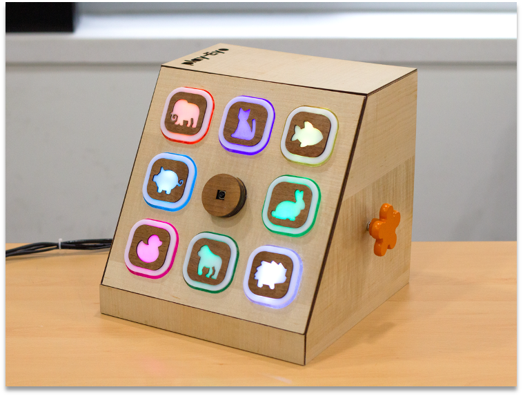

# PlayEye - Toy for Preventing Child Myopia



## Overview

Welcome to PlayEye, our award-winning toy designed to prevent child myopia and promote healthy eye habits in a playful and engaging manner. PlayEye utilizes a combination of visual, audio, and tactile inputs and outputs to provide a comprehensive and enjoyable experience for children. Developed with the well-being of young users in mind, PlayEye aims to enhance cognitive development while fostering regular eye exercises to prevent child myopia.

## Key Features

- **Myopia Prevention:** PlayEye is a specialized toy crafted to prevent child myopia, offering a fun and interactive solution for promoting regular eye exercises.

- **Enhanced Cognitive Development:** The toy goes beyond its primary function, also contributing to the cognitive development of children through interactive and engaging activities.

- **Gaze Detection for Gamification:** PlayEye incorporates gaze detection technology using a Picamera2 to gamify three different types of eye exercises. This innovative feature adds an element of playfulness and interactivity to the eye exercise routine.
  We acknowledge that we have borrowed some code from [GazeTracking](https://github.com/antoinelame/GazeTracking.git) to enhance certain functionalities. A big shoutout to the original contributors for their valuable work!

- **Hardware Implementation:** PlayEye is implemented with a Raspberry Pi, utilizing a Picamera2, 4-pin rotary switch, speaker module, number keyboard, and LED to provide a multisensory experience.

- **Multisensory Interaction:** Leveraging visual, audio, and tactile inputs and outputs, PlayEye creates a holistic and engaging experience for children.

- **Educational UI:** Featuring a user-friendly interface, PlayEye allows users to understand the inner workings of the toy, making the learning experience both enjoyable and educational.

## Awards and Recognition

PlayEye proudly received the Grand Prize at the Creative Design Fair held by SNU Engineering in 2023, a testament to its innovative and impactful design.


## How to Run Player

To run PlayEye on your system, follow these steps:

1. **Clone the Repository:**
```
git clone https://github.com/SNU-EyeFi/PlayEye.git
```

2. **Modify Hardware Code:**
Before running PlayEye, make sure to modify the hardware-related code to fit your environment. Please check and update the following files according to your setup:

- `led.py`
- `switch.py`
- `touch.py`

3. **Run PlayEye:**
```
export PYTHONPATH=./
python -m scripts.main <window_type> [-v]
```

- `<window_type>`: Specify the window type, which can be either `vertical` or `horizontal`.
- `-v`: Use the `-v` option for verbose output, displaying gaze detecting information (only supported for horizontal).

Example:
```
python -m scripts.main horizontal -v
```

## Our Team, EyeFi

EyeFi is developed by a team of four undergraduate students with diverse engineering backgrounds. We are passionate about creating innovative solutions to address real-world challenges. 

## Feedback and Issues

If you encounter any issues or have suggestions for improvement, please open an issue on our [GitHub repository](https://github.com/your-username/playeye/issues), or contact through email (sieunk@snu.ac.kr).
